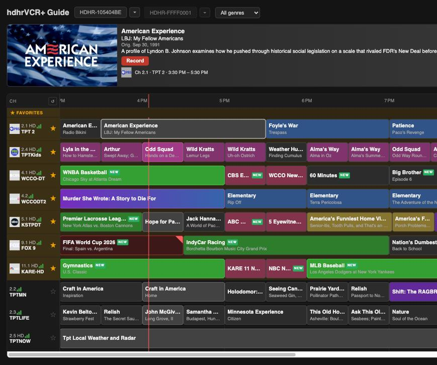
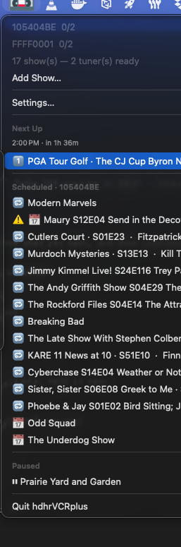
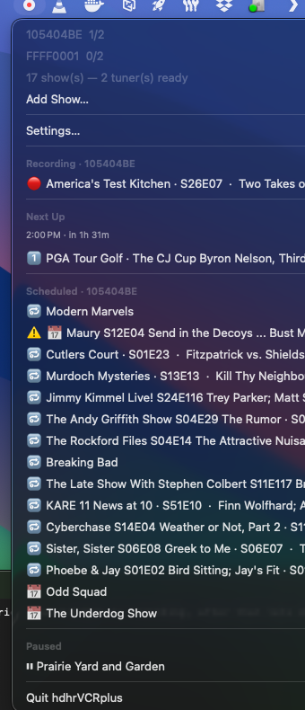
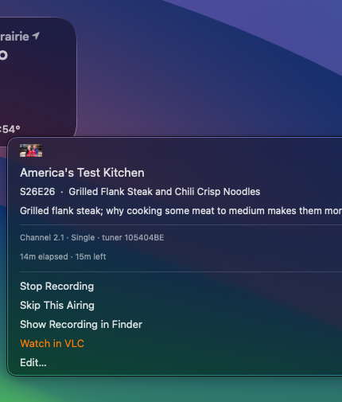
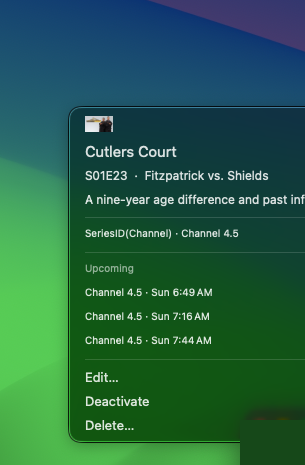
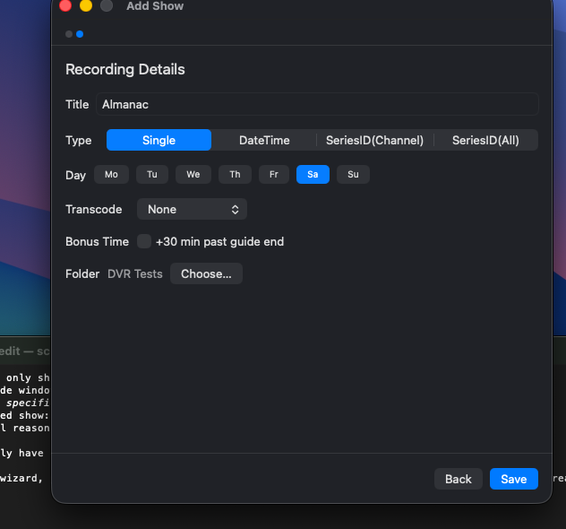
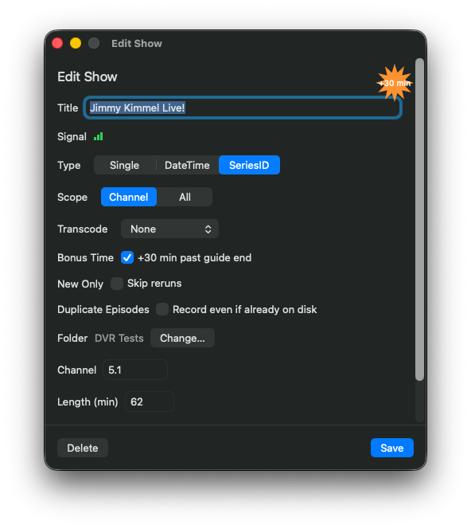
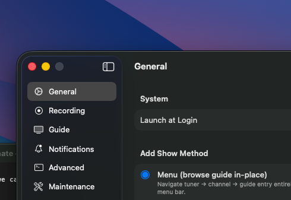
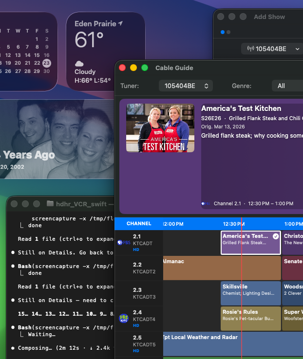

# 📺 hdhrVCRplus

**Free, open-source DVR for your HDHomeRun — lives in your Mac menu bar, records in the background.**

No subscription. No media server. No cloud account. Just your tuner, your Mac, and your shows.

[](https://github.com/identd113/hdhr_VCR_swift/releases)
[](Package.swift)
[](https://github.com/identd113/hdhr_VCR_swift/releases)
[](https://github.com/identd113/hdhr_VCR-AS)

---



---

## Why hdhrVCRplus?

You already paid for an HDHomeRun tuner and a cable/antenna subscription. You shouldn't have to pay again just to record TV.

| | hdhrVCRplus | SiliconDust DVR Service | Plex DVR | Channels DVR | EyeTV |
|---|---|---|---|---|---|
| **Cost** | **Free** | $35/yr | $6.99/mo (Plex Pass) | $8/mo or $80/yr | $79.99 + guide sub |
| **Runs on** | Menu bar | Cloud + app | Media server | Media server | App |
| **macOS menu bar** | ✅ | ❌ | ❌ | ❌ | ❌ |
| **Series recording** | ✅ | ✅ | ✅ | ✅ | ✅ |
| **Cable guide grid** | ✅ | ✅ | ✅ | ✅ | ✅ |
| **Built-in player** | ✅ VLC | ✅ | ✅ | ✅ | ✅ |
| **Discord notifications** | ✅ | ❌ | ❌ | ❌ | ❌ |
| **LAN web UI** | ✅ guide/schedule | ✅ + stream | ✅ + stream | ✅ + stream | ❌ |
| **Cloud-free** | ✅ | ❌ | ❌ | ❌ | ❌ |
| **Open source** | ✅ | ❌ | ❌ | ❌ | ❌ |

**The short version:** hdhrVCRplus does everything the paid services do, costs nothing, runs entirely on your Mac, and gets out of your way in the menu bar.

---

## Screenshots

| Menu bar | Recording in progress |
|----------|-----------------------|
|  |  |

| Recording submenu | Scheduled show |
|-------------------|----------------|
|  |  |

| Add Show — Details | Edit Show |
|--------------------|-----------|
|  |  |

| Settings | Standalone Guide |
|----------|-----------------|
|  |  |

---

## Features

### It's a DVR that stays out of your way

- **Menu bar only** — no Dock icon, no full-screen window. One click to see everything; it disappears when you click away.
- **Fully automated** — scheduling, recording, tuner management, and failure recovery all happen silently in the background.
- **Survives restarts** — reattaches to in-progress recordings after a crash or relaunch. Shows that fail too often are automatically paused.

### Scheduling

- **Cable TV-style guide** — scrollable grid showing channels and upcoming shows, color-coded by genre. Click to schedule, double-click to confirm.
- **Four recording modes** — one-off, weekly repeat, or series-based (see [Recording Modes](#recording-modes) below)
- **Per-show bonus time** — add extra padding to individual shows (great for sports)
- **Pop-out guide browser** — browse the full guide in its own window any time, without going through Add Show

### Watching

- **Watch Now! (in-app player)** — stream live TV in a built-in VLC-powered window with a channel picker, volume, and audio output controls. Checks tuner availability before opening so you're never silently blocked.
- **Watch a recording in progress — for free** — click "Watch Now!" on a show that's currently recording and it plays straight from disk instead of opening a second tuner. Hover over the video for a scrub bar to jump anywhere already recorded, and switch between simultaneous recordings right from the channel picker.
- **Live tuner status** — the menu header shows exactly how many tuners are in use and by what, at a glance

### Notifications

- **macOS alerts** — "Up Next" and "Recording Soon" before each show
- **Discord webhooks** — rich embeds for recording started, completed (with file size), failed, paused, conflict, and more. Per-event toggles with live Test buttons in Settings — no waiting for a real recording

### Remote access

- **LAN web UI** — built-in web server (port 1980) serves a cable guide grid, schedule view, and what's-on-now cards accessible from any browser on your network. No port forwarding needed; subnet-guarded. (Viewing is Mac-only via the in-app VLC player.)

### Multi-device & formats

- **Multi-tuner support** — discovers and manages multiple HDHomeRun devices (CONNECT, PRIME, EXTEND, FLEX, etc.) via mDNS and UDP broadcast
- **EXTEND support** — uses SiliconDust's cloud guide API for HDTC-2US devices
- **Transcode options** — none (`.m2ts`), heavy, mobile, or internet720 (`.mkv` via the device)
- **Sleep prevention** — uses `caffeinate` so recordings survive display sleep

---

## What's New in v1.3.0

**Watch a recording without a second tuner** — "Watch Now!" on a currently-recording show now plays it straight from disk instead of tuning the channel again, with a scrub bar to jump around what's already recorded and a channel-picker shortcut to switch between simultaneous recordings.

Everything else (LAN web UI, Discord notifications, per-show bonus time, etc.) is covered above under [Features](#features) — see the → [full changelog](CHANGELOG.md) for the complete release history.

---

## Requirements

- **macOS 15.0** (Sequoia) or later
- An **HDHomeRun** network tuner (CONNECT, PRIME, EXTEND, FLEX, etc.) on your local network
- **VLC** (`/Applications/VLC.app`) — optional, for Watch Now! playback

---

## Installation

### Download a release (easiest)

1. Download `hdhrVCRplus-vX.X.X.zip` from the [Releases page](https://github.com/identd113/hdhr_VCR_swift/releases)
2. Unzip and move `hdhrVCRplus.app` to `/Applications`
3. Right-click → **Open** on first launch (see [Gatekeeper](#gatekeeper) below)

### Build from source

```bash
# Prerequisites: macOS 15+, Xcode Command Line Tools
xcode-select --install   # skip if already installed

# Clone and launch in one step
git clone https://github.com/identd113/hdhr_VCR_swift.git
cd hdhr_VCR_swift
./deploy.sh
```

`deploy.sh` builds, bundles, signs, and launches in one shot. No Xcode.app required.

Other useful commands:

```bash
swift build          # build only, no bundling/launch
swift test           # run tests
./deploy_release.sh  # release build + Developer ID sign + notarize
```

### Gatekeeper (first launch only) {#gatekeeper}

macOS will block the downloaded app the first time. Do **one** of:

- Right-click `hdhrVCRplus.app` → **Open** → click **Open** in the dialog
- Or run: `xattr -d com.apple.quarantine hdhrVCRplus.app`

macOS remembers the exception — subsequent launches work normally.

> **Why no notarization?** Notarization requires an Apple Developer Program membership ($99/yr). This is a free, open-source project — you can inspect and build the full source yourself.

---

## Setup

The app discovers HDHomeRun tuners automatically on first launch. If none are found:

1. Confirm the tuner is powered on and on the same network
2. Open **Settings → Maintenance → Rediscover Devices**

Config is saved automatically at:
```
~/Library/Application Support/hdhrVCRplus/hdhr_VCR-{hostname}.json
```

---

## Adding Shows

### Wizard mode (default)

**Menu bar icon → Add Show…** opens a 3-step wizard:

1. **Select Tuner** — choose device (skipped with only one tuner)
2. **Guide** — browse the cable grid; click to select, double-click to advance
3. **Details** — recording type, air days, transcode, save folder

### Menu mode

Switch in **Settings → General → Add Show Method** for a faster inline flow directly from the menu bar.

---

## Recording Modes

| Mode | When to use |
|------|-------------|
| **Single** | One-off recording — deactivated after it completes |
| **DateTime** | Same weekday + time every week (news, late night, etc.) |
| **SeriesID (Channel)** | Any episode of a series on one channel |
| **SeriesID (All)** | Any episode of a series on any channel |

Shows that fail more than the configured threshold (default: 3) are automatically paused.

---

## Menu Bar Icon

| Icon | Meaning |
|------|---------|
| 📺 (dim) | Starting up |
| 📺 | Idle — nothing due in 30 minutes |
| 🕐 orange | A show starts within 30 minutes |
| ⏺ red | Recording in progress |

---

## Settings Reference

| Section | Key options |
|---------|-------------|
| **General** | Launch at Login; Add Show mode (wizard vs menu) |
| **Recording** | Save folder; transcode profile; min free disk; failure threshold |
| **Guide** | Hours of guide data; series scan retry interval |
| **Notifications** | Up Next / Recording Soon timing; Discord webhook + per-event toggles |
| **Web Server** | Enable/disable; port; live status and access URL |
| **Advanced** | Idle interval; verbose curl logging |
| **Maintenance** | Rescan Series; Reset Fail Counts; Reactivate Paused; Refresh Guide; Rediscover Devices |
| **About** | Version history (rendered Markdown); link to GitHub |

Settings use a **draft/save** pattern — click **Save** (⌘S) to apply. Closing with unsaved changes prompts to save or discard.

---

## Recordings

Default save location: `~/Documents/hdhr_videos` (created automatically). Configurable globally in Settings or per-show via **Edit…** in the menu.

File naming: `ShowTitle_Channel_YYYYMMDD_HHmm.m2ts` (or `.mkv` for transcoded recordings).

---

## Background

hdhr_VCR started in 2016 as an AppleScript app to fill the gap left by discontinued HDHomeRun recording software on macOS. This Swift/SwiftUI rewrite brings a native menu bar UI, cable-guide grid, in-app VLC player, Discord notifications, and a LAN web server — while keeping full compatibility with the original config format.

**Swift/SwiftUI version:** [identd113/hdhr_VCR_swift](https://github.com/identd113/hdhr_VCR_swift)  
**Original AppleScript version:** [identd113/hdhr_VCR-AS](https://github.com/identd113/hdhr_VCR-AS)
