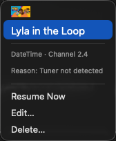

# hdhrVCRplus

A macOS menu bar app for recording live TV from [HDHomeRun](https://www.silicondust.com) network tuners. Lives in your menu bar — no Dock icon — and records in the background while you work.

This is a Swift/SwiftUI rewrite of the original [hdhr_VCR AppleScript app](https://github.com/identd113/hdhr_VCR-AS), which has been running since 2016. It reads and writes the same config file format, so both versions can coexist.

---

## What's New

**Discord notifications** — Get a rich Discord message when a recording starts, finishes (including file format and size), fails, or hits a tuner conflict. Choose exactly which events notify you and send a live test from Settings without waiting for a real recording.

**Built-in TV player** — "Watch Now!" streams live TV directly in the app using your installed VLC. Includes a channel picker so you can switch without reopening the menu, plus volume and audio output controls. The app checks whether a tuner is actually free before opening, so you're never silently blocked.

**Pop-out guide browser** — Browse the full cable guide in its own window anytime, without going through the Add Show wizard. Great for checking what's on without committing to a recording.

**Per-show bonus time** — Add extra recording padding to individual shows, not just globally. Handy for sports or anything that reliably runs long.

**Smarter menus** — The menu bar header now shows live tuner usage for each device at a glance. The Add Show wizard skips the device-picker step when you only have one tuner. The in-app player now appears for any on-air show the moment VLC is installed — no hidden unlock required.

**VPN-aware network binding** — Network interface selection now correctly identifies active VPN tunnels (versus inactive system interfaces), so recordings work reliably when connected to a VPN.

**Changelog in Settings** — Full version history is rendered as rich text directly in Settings → About.

**Reliability fixes** — Shows now re-schedule correctly after a restart that happened mid-recording-window; cable guide vertical scroll sync restored; time formats corrected for non-US locales.

---

## Features

- **Menu bar recording** — start, monitor, and stop recordings from the menu bar without opening a full app window
- **Cable TV-style guide** — scrollable grid showing all channels and upcoming shows, color-coded by genre
- **Four recording modes**:
  - **Single** — record one episode, then done
  - **DateTime** — repeat every week on the same day and time
  - **SeriesID (Channel)** — any episode of a series on a specific channel
  - **SeriesID (All Channels)** — any episode of a series on any channel
- **Multi-device support** — discovers and manages multiple HDHomeRun tuners on the network
- **EXTEND support** — uses SiliconDust's cloud guide API for HDTC-2US devices
- **Notifications** — "Up Next" and "Recording Soon" alerts before each show
- **Discord webhooks** — rich embeds for recording events (started, complete with file size, failed, paused, conflict, and more); per-event toggles with Test buttons in Settings
- **Sleep prevention** — uses `caffeinate` so recordings survive display sleep
- **Transcode options** — none (`.m2ts`), heavy, mobile, or internet720 (`.mkv` via the device)
- **Watch in VLC** — open any live stream in VLC directly from the menu
- **Watch Now! (in-app player)** — stream live TV in a built-in VLC-powered window with channel picker, volume, and audio output controls; checks tuner availability before opening
- **Launch at Login** — stay running in the background automatically
- **Survives restarts** — reattaches to in-progress recordings after a crash or relaunch

---

## Screenshots

| Menu bar | Cable guide |
|----------|-------------|
|  |  |

| Recording in progress | Scheduled show submenu |
|-----------------------|------------------------|
|  |  |

| Recording submenu | Paused show submenu |
|-------------------|---------------------|
|  |  |

| Add Show — Details | Edit Show |
|--------------------|-----------|
|  |  |

| Cable guide (standalone) | Settings |
|--------------------------|----------|
|  |  |

---

## Requirements

- **macOS 15.0** (Sequoia) or later
- An **HDHomeRun** network tuner (CONNECT, PRIME, EXTEND, FLEX, etc.)
- The tuner must be reachable on your local network

Optional:
- **VLC** (`/Applications/VLC.app`) for live stream preview

---

## Installation

### Option A — Download a release

Download `hdhrVCRplus-vX.X.X.zip` from the [Releases page](https://github.com/identd113/hdhr_VCR_swift/releases), unzip it, and move `hdhrVCRplus.app` wherever you like.

### Option B — Build from source

**Prerequisites**: macOS 15.0+, Xcode Command Line Tools (no full Xcode required).

Install the tools if you haven't already:

```bash
xcode-select --install
```

Then:

```bash
# 1. Clone the repo
git clone https://github.com/identd113/hdhr_VCR_swift.git
cd hdhr_VCR_swift

# 2. Build, bundle, sign, and launch
./deploy.sh
```

`deploy.sh` does everything in one step: stops any running instance, runs `swift build`, copies the binary into `hdhrVCRplus.app`, generates the app icon, ad-hoc signs the bundle, and launches it. The app appears in your menu bar as a TV icon.

### First launch — Gatekeeper

This app is **ad-hoc signed** (no Apple Developer ID), so macOS Gatekeeper will block it on first launch with *"hdhrVCRplus can't be opened because Apple cannot check it for malicious software."*

To open it, do **one** of the following:

- **Right-click** `hdhrVCRplus.app` → **Open** → click **Open** in the dialog, or
- Run in Terminal: `xattr -d com.apple.quarantine hdhrVCRplus.app`

macOS remembers the exception after the first open — subsequent launches work normally.

> **Why not notarized?** Notarization requires an Apple Developer Program membership ($99/yr). This is an open-source personal project; you can inspect and build the full source yourself via `./deploy.sh`.

---

## Setup

On first launch, the app will search for HDHomeRun tuners on your network automatically. If none are found:

1. Make sure your HDHomeRun is powered on and connected to the same network
2. Open **Settings → Maintenance → Rediscover Devices** to retry

The config file is created automatically at:
```
~/Library/Application Support/hdhrVCRplus/hdhr_VCR-{hostname}.json
```

---

## Adding Shows

### Wizard mode (default)

Click the menu bar icon → **Add Show…** to open the 3-step wizard:

1. **Select Tuner** — choose which HDHomeRun device to record from (skipped if you only have one)
2. **Guide** — browse the cable TV-style grid; click a show to select it, double-click to advance
3. **Details** — set the recording type, air days, transcode, and save folder

### Menu mode

Switch to menu mode in **Settings → General → Add Show Method** for a faster inline flow: click the menu bar icon → **Add Show** → Channel → Guide Entry → recording type.

---

## Menu Bar Icon

| Icon | Meaning |
|------|---------|
| 📺 (dim) | App is starting up |
| 📺 | Idle — no upcoming shows within 30 minutes |
| 🕐 (orange) | A show starts within 30 minutes |
| ⏺ (red) | Recording in progress |

---

## Recording Modes

| Mode | Description |
|------|-------------|
| **Single** | Records once. Show is deactivated after the recording completes. |
| **DateTime** | Repeats on the same weekday(s) and time each week on a fixed channel. |
| **SeriesID (Channel)** | Records any episode of the series that airs on a specific channel. |
| **SeriesID (All)** | Records any episode of the series on any channel. |

Shows that fail more than the configured threshold (default: 3) are automatically paused and can be reactivated from the **Paused** section of the menu.

---

## Settings

Open via the menu bar icon → **Settings…**

| Category | Key Options |
|----------|-------------|
| **General** | Launch at Login; Add Show mode (wizard vs menu) |
| **Recording** | Default save folder; transcode profile; minimum free disk space; failure threshold; Watch in VLC |
| **Guide** | Hours of guide data to fetch; series scan retry interval |
| **Notifications** | "Up Next" alert timing; "Recording Soon" alert timing; Discord webhook URL + per-event toggles with Test buttons |
| **Advanced** | Idle check interval; verbose curl logging; config file location |
| **Maintenance** | Rescan Series; Reset Fail Counts; Reactivate Paused Shows; Refresh Guide; Rediscover Devices |
| **About** | App history, version, GitHub link |

Settings use a **draft/save** pattern — changes are not applied until you click **Save** (⌘S). Closing the window with unsaved changes prompts to save or discard.

---

## Config File

The config file lives at:

```
~/Library/Application Support/hdhrVCRplus/hdhr_VCR-{hostname}.json
```

A `.json.bak` backup is created before each save. On first launch the app automatically migrates an existing config from the old `~/Documents/` location — the original file is left in place so the AppleScript version continues to work.

---

## Recordings

By default, recordings are saved to `~/Documents/hdhr_videos` (created automatically). You can set a different folder in **Settings → Recording → Default folder**, or per-show via **Edit…** in the menu.

File naming: `ShowTitle_Channel_YYYYMMDD_HHmm.m2ts` (or `.mkv` for transcoded recordings).

---

## Building from Source

**Prerequisites**: macOS 15.0+, Xcode Command Line Tools.

```bash
xcode-select --install   # one-time setup, skip if already installed
```

```bash
# Clone
git clone https://github.com/identd113/hdhr_VCR_swift.git
cd hdhr_VCR_swift

# Build + bundle + sign + launch (most common)
./deploy.sh

# Build only (no launch)
swift build

# Run tests
swift test
```

`swift build` produces the binary at `.build/debug/hdhr_VCR` (the Swift target name). `./deploy.sh` copies it into `hdhrVCRplus.app`, ad-hoc signs the bundle, and launches it — no Xcode.app required, just the Command Line Tools.

---

## Background

hdhr_VCR started in 2016 as an AppleScript application to fill the gap left by discontinued HDHomeRun recording software. This Swift/SwiftUI rewrite brings a native menu bar UI, a cable-guide grid, and modern macOS features while keeping full compatibility with the original config format.

Swift/SwiftUI version: [identd113/hdhr_VCR_swift](https://github.com/identd113/hdhr_VCR_swift)

Original AppleScript version: [identd113/hdhr_VCR-AS](https://github.com/identd113/hdhr_VCR-AS)
