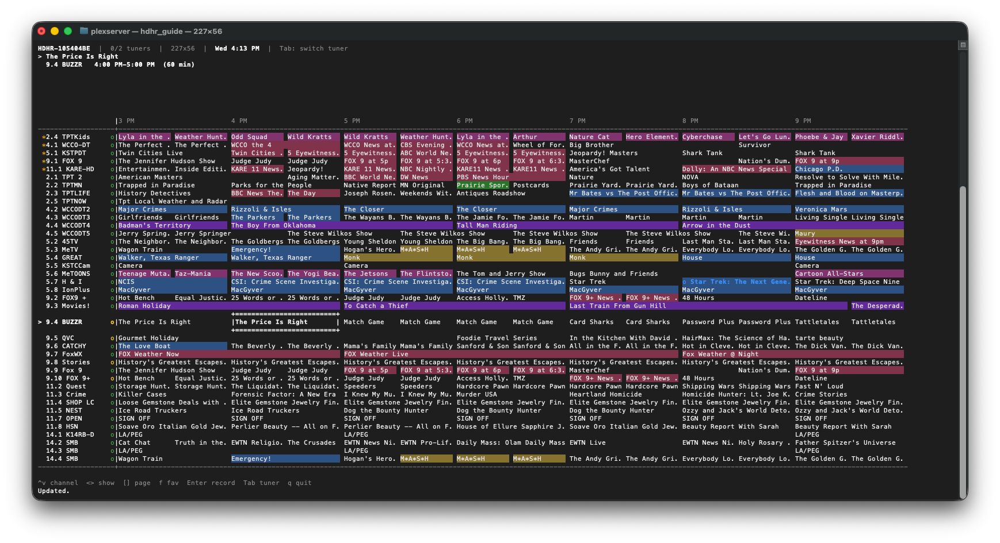
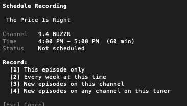

<p align="center"></p>

# hdhrVCRplus

**Free, open-source DVR for your HDHomeRun — lives in your Mac menu bar, records in the background.**

No subscription. No media server. No account to create. Just your tuner, your Mac, and your shows —
though guide data still ultimately comes from SiliconDust's free cloud service (via the tuner itself
for over-the-air devices, direct from the app for EXTEND/cable ones); that part isn't something this
app can opt out of.

**✅ Notarized by Apple — download, unzip, and open. No Gatekeeper warning, no bypass step.**

[](https://github.com/identd113/hdhr_VCR_swift/actions/workflows/ci.yml)
[](https://github.com/identd113/hdhr_VCR_swift/releases)
[](Package.swift)
[](https://github.com/identd113/hdhr_VCR_swift/releases)
[](RELEASES.md)
[](LICENSE)
[](https://github.com/identd113/hdhr_VCR-AS)

### 📦 Latest: [v2.1.0](https://github.com/identd113/hdhr_VCR_swift/releases/download/v2.1.0/hdhrVCRplus-2.1.0.zip)
- New: Terminal Guide — browse the guide and schedule recordings from the terminal, no browser needed
- Pull-to-refresh on the web guide
- "New Only" recording option — skip reruns the guide hasn't flagged as new
- SeriesID(Channel)/SeriesID(All) are now one option with a Channel/All scope toggle

**[📋 Release Notes](RELEASES.md)** — what's new in each version, with download links.

---


The full LAN web guide — channels down the side, time across the top, tiles color-coded by genre.
The vertical red line is a live "now" indicator that creeps across the grid in real time. Favorited
channels get pulled into their own **★ FAVORITES** row up top so they're never buried in a big
lineup, green **NEW** badges flag episodes the guide hasn't marked as reruns, and the per-channel
signal bars in the gutter (fed by real tuner SNQ samples) tell you at a glance which channels are
solid before you schedule off them. The top bar switches between tuners and genre filters without
leaving the page.

---

## Why hdhrVCRplus?

You already paid for an HDHomeRun tuner, so you shouldn't have to pay again just to record TV.

| | hdhrVCRplus | SiliconDust DVR Service | Plex DVR | Channels DVR | EyeTV |
|---|---|---|---|---|---|
| **Cost** | **Free** | $35/yr | $6.99/mo (Plex Pass) | $8/mo or $80/yr | $79.99 + guide sub |
| **Runs on** | Menu bar | Cloud + app | Media server | Media server | App |
| **macOS menu bar** | ✅ | ❌ | ❌ | ❌ | ❌ |
| **Series recording** | ✅ | ✅ | ✅ | ✅ | ✅ |
| **Cable guide grid** | ✅ | ✅ | ✅ | ✅ | ✅ |
| **Built-in player** | ✅ VLC | ✅ | ✅ | ✅ | ✅ |
| **Discord notifications** | ✅ | ❌ | ❌ | ❌ | ❌ |
| **LAN web UI** | ✅ guide/schedule | ✅ + stream | ✅ + stream | ✅ + stream | ❌ |
| **Cloud-free** | ✅ | ❌ | ❌ | ❌ | ❌ |
| **Open source** | ✅ | ❌ | ❌ | ❌ | ❌ |

**The short version:** hdhrVCRplus does everything the paid services do, costs nothing, runs entirely on your Mac, and gets out of your way in the menu bar.

---

## Screenshots

The cable guide itself is pictured at the top of this page — the rest of the app's screens below.

### Menu bar

| Idle | Recording |
|------|-----------|
|  |  |

Click the menu bar icon and everything scheduled is right there — no window to open. **Up Next**
always shows what's about to record, **Scheduled** lists everything else queued up, and the moment a
recording actually starts, it jumps into its own pulsing-red **Recording Now** section at the top so
you don't have to go hunting through the list to check status.

### Managing a show

| Recording submenu | Scheduled series |
|--------------------|-------------------|
|  |  |

Click any show in the menu for its own submenu. A show that's actively recording gets **Watch
Now!** (stream what's already on disk, live, without touching the tuner) and **Show Recording in
Finder**; a scheduled series shows its **Upcoming** airings — every future date/time it's about to
record — plus one-click **Pause**/**Delete**, right from the menu bar.

### Add / Edit show

| Add Show — Details | Edit Show |
|--------------------|-----------|
|  |  |

Scheduling by **SeriesID** (not just title matching) means reruns and retitled episodes still get
caught — the **Channel / All** toggle decides whether that series only records on the channel you
picked it from or follows it anywhere on the tuner, and **Other Upcoming Airings** shows every other
time it's on before you commit. Toggle **Bonus Time** on Edit and an animated starburst badge
(`+30 min`) pins itself to the corner — a Sports show gets this on by default, since live events run
long.

### Settings


A standard macOS settings window (General/Recording/Guide/Notifications/Advanced/Web
Server/Maintenance/About) — Launch at Login, menu bar icon blinking, and the guide format used to
pull program data all live here.

### Terminal Guide

| Channel grid | Schedule recording |
|--------------|---------------------|
|  |  |

The whole cable guide, in a terminal — SSH in from anywhere on your network and schedule recordings
without a browser. The selected tile gets a full white box drawn right onto its genre color, a
per-channel signal dot in the gutter mirrors the web guide's own bars, and hitting `Enter` drops into
a dedicated recording screen with the same four scope options (Once / Weekly / Series-this-channel /
Series-any-channel) as the web and native pickers. Every glyph is plain ASCII on purpose — no
box-drawing characters that render one column too wide on some remote terminals — so it looks right
whether you're on Terminal.app or three hops away over SSH.

---

## Features

### It's a DVR that stays out of your way

- **Menu bar only** — no Dock icon, no full-screen window. One click to see everything; it disappears when you click away.
- **Fully automated** — scheduling, recording, tuner management, and failure recovery all happen silently in the background.
- **Survives restarts** — reattaches to in-progress recordings after a crash or relaunch. Shows that fail too often are automatically paused.
- **Auto-pause when a tuner goes missing, auto-resume when it's back** — a show scheduled on a tuner that stops responding pauses itself instead of quietly failing over and over; picks back up the moment the tuner reappears. Never touches a show you paused yourself.
- **Universal binary** — runs natively on both Apple Silicon and Intel Macs, no Rosetta.

### Scheduling

- **Cable TV-style guide** — scrollable grid showing channels and upcoming shows, color-coded by genre. Click to schedule, double-click to confirm.
- **Four recording modes** — one-off, weekly repeat, or series-based (see [Recording Modes](#recording-modes) below)
- **Per-show bonus time** — add extra padding to individual shows (great for sports)
- **Skip already-recorded episodes** — a series won't grab the same episode twice on a rerun or simulcast. Before recording, it checks whether that season/episode is already on disk and quietly advances to the next airing if so (Settings → Post-Processing; requires Series subfolders)
- **New Only** — a separate toggle that skips airings the guide itself doesn't flag as a new episode (today/tonight's original air date), independent of what's already on disk — catches a rerun the app has never recorded at all, which "Skip already-recorded" can't
- **Signal quality at scheduling** — Add Show, Edit Show, and the web guide's Record form show a channel's signal bars, with a weak-signal warning, before you commit to recording it
- **Metadata sidecar files** — writes a Kodi-style `.nfo` alongside each recording with episode title, season/episode, air date, synopsis, genre, and runtime (Settings → Post-Processing, off by default)

### Watching

- **Watch Now! (in-app player)** — stream live TV in a built-in VLC-powered window with a channel picker, volume, and audio output controls. Checks tuner availability before opening so you're never silently blocked.
- **Watch a recording in progress — for free** — click "Watch Now!" on a show that's currently recording and it plays straight from disk instead of opening a second tuner. Hover over the video for a scrub bar to jump anywhere already recorded, and switch between simultaneous recordings right from the channel picker.
- **True fullscreen** — Esc to exit, arrow-key seeking (15s back / 30s forward), and a labeled toolbar that hides itself until you move the cursor to the top of the screen.
- **Live tuner status** — the menu header shows exactly how many tuners are in use and by what, at a glance

### Notifications

- **macOS alerts** — "Up Next" and "Recording Soon" before each show
- **Discord webhooks** — rich embeds for recording started, completed (with file size), failed, paused, conflict, and more. Per-event toggles, with a live Test button for the webhook in Settings — no waiting for a real recording

### Remote access

- **LAN web UI** — built-in web server (port 1980) serves the same cable guide grid, with per-tuner Recording/Up Next/Scheduled lists, accessible from any browser on your network. No port forwarding needed; subnet-guarded. Pull down at the top of the grid to refresh in place, no page reload. (Viewing is Mac-only via the in-app VLC player.)
- **Portrait phone layout at `/vertical`** — visit `http://<mac-ip>:1980/vertical` on your phone for a calendar-style guide: channels become side-by-side columns, time reads top-to-bottom. Responds live to how you're holding the phone, no toggle to remember; the plain root URL always stays the standard horizontal grid regardless of device, if you'd rather bookmark that instead.
- **Terminal Guide** — a full-screen terminal client for browsing the guide and scheduling recordings without a browser, bundled with the app (`hdhrVCRplus.app/Contents/Helpers/hdhr_guide`). Run it over SSH from anywhere on your network, or click "Open in Terminal" in Settings → Sharing. Same schedule/delete/favorite actions as the web guide, all from a keyboard.

### Multi-device & formats

- **Multi-tuner support** — discovers and manages multiple HDHomeRun devices (CONNECT, PRIME, EXTEND, FLEX, etc.) via mDNS and UDP broadcast
- **EXTEND support** — uses SiliconDust's cloud guide API for HDTC-2US devices
- **Transcode options** — none, heavy, mobile, or internet720 — all written as `.ts`, the tuner's actual wire format (transcoding re-encodes the video only; the container never changes)
- **Sleep prevention** — holds an IOKit power assertion so recordings survive display sleep
- **Export/Import Config** — copy your whole setup (every setting, all scheduled shows, Discord webhook) to another Mac in one file, from Settings → Advanced. Tuners themselves are always rediscovered fresh on the new machine, not carried over.

---

## What's New

See **[RELEASES.md](RELEASES.md)** for what changed in the current release and every version
before it, or the → [full changelog](Sources/hdhr_VCR/CHANGELOG.md) for the complete list.

Everything else (LAN web UI, Discord notifications, per-show bonus time, watching a recording in
progress without a second tuner, etc.) is covered above under [Features](#features).

---

## Requirements

- **macOS 15.0** (Sequoia) or later
- An **HDHomeRun** network tuner (CONNECT, PRIME, EXTEND, FLEX, etc.) on your local network
- **VLC** (`/Applications/VLC.app`) — optional, for Watch Now! playback

---

## Installation

### Download a release (easiest)

1. Download `hdhrVCRplus-vX.X.X.zip` from the [Releases page](https://github.com/identd113/hdhr_VCR_swift/releases)
2. Unzip and move `hdhrVCRplus.app` to `/Applications` (skip this and it'll offer to move itself there on first launch instead)
3. Open it — the app is notarized by Apple, so there's no "unidentified developer" warning or bypass step needed (see [Notarization and Gatekeeper](#notarization-and-gatekeeper) below)

### Build from source

```bash
# Prerequisites: macOS 15+, Xcode Command Line Tools
xcode-select --install   # skip if already installed

# Clone and launch in one step
git clone https://github.com/identd113/hdhr_VCR_swift.git
cd hdhr_VCR_swift
./deploy.sh
```

`deploy.sh` builds, bundles, signs, and launches in one shot. No Xcode.app required.

Other useful commands:

```bash
swift build          # build only, no bundling/launch
swift test           # run tests
./deploy_release.sh  # release build + Developer ID sign + notarize
```

### Notarization and Gatekeeper

Every release from v2.0.0 onward is signed with a Developer ID certificate and notarized by Apple
(the ticket is stapled to the app, so verification works offline too) — macOS accepts it as a
normal app on first launch, no warning dialog or bypass step required. See
[RELEASES.md](RELEASES.md) for what changed in each version, or `docs/Distribution.md` for how
this is built and verified.

Building from source yourself (`./deploy.sh`), or running a release older than v2.0.0? Those
builds are ad-hoc signed, not notarized, so macOS will show its standard "unidentified developer"
prompt once. Do **one** of:

- Right-click `hdhrVCRplus.app` → **Open** → click **Open** in the dialog
- Or run: `xattr -d com.apple.quarantine hdhrVCRplus.app`

macOS remembers the exception — subsequent launches work normally.

---

## Setup

The app discovers HDHomeRun tuners automatically on first launch. If none are found:

1. Confirm the tuner is powered on and on the same network
2. Open **Settings → Maintenance → Rediscover Devices**

Config is saved automatically at:
```
~/Library/Application Support/hdhrVCRplus/hdhr_VCR-{hostname}.json
```

---

## Adding Shows

**Menu bar icon → Add Show…** opens a 3-step wizard:

1. **Select Tuner** — choose device (skipped with only one tuner)
2. **Guide** — browse the cable grid; click to select, double-click to advance
3. **Details** — recording type, air days, transcode, save folder

---

## Recording Modes

| Mode | When to use |
|------|-------------|
| **Single** | One-off recording — deactivated after it completes |
| **DateTime** | Same weekday + time every week (news, late night, etc.) |
| **SeriesID (Channel)** | Any episode of a series on one channel |
| **SeriesID (All)** | Any episode of a series on any channel |

Shows that fail more than the configured threshold (default: 3) are automatically paused.

---

## Menu Bar Icon

The VHS-cassette icon's label doubles as a status light:

| State | Icon | Meaning |
|------|------|---------|
| Starting up | Dimmed (30% opacity) | App isn't ready yet — still discovering devices/lineup/guide |
| Idle | Full opacity, light off | Nothing due in 30 minutes |
| Show soon | Light lit amber | A show starts within 30 minutes |
| Recording | Light lit red | Recording in progress |

The lit states blink on a 6-second cycle if "Blink menu bar icon" is enabled in Settings → General (off by default).

---

## Settings Reference

| Section | Key options |
|---------|-------------|
| **General** | Launch at Login |
| **Recording** | Save folder; transcode profile; min free disk; failure threshold |
| **Guide** | Hours of guide data; series scan retry interval |
| **Notifications** | Up Next / Recording Soon timing; Discord webhook + per-event toggles |
| **Advanced** | Idle interval; verbose curl logging |
| **Web Server** | Enable/disable; port; live status and access URL |
| **Maintenance** | Rescan Series; Reset Fail Counts; Reactivate Paused; Refresh Guide; Rediscover Devices |
| **About** | Version history (rendered Markdown); link to GitHub |

Settings use a **draft/save** pattern — click **Save** (⌘S) to apply. Closing with unsaved changes prompts to save or discard.

---

## Recordings

Default save location: `~/Movies/hdhr_videos` (created automatically). Configurable globally in Settings or per-show via **Edit…** in the menu.

File naming: `ShowTitle_Channel_YYYYMMDD_HHmm.ts`.

---

## For Developers

Contributions are welcome — see [CONTRIBUTING.md](.github/CONTRIBUTING.md) to get started.

- **[Wiki](https://github.com/identd113/hdhr_VCR_swift/wiki)** — architecture and per-view/per-system technical documentation (mirrors [`docs/`](docs/) in this repo)
- **[ISSUES.md](ISSUES.md)** — known issues and resolved-bug history
- **[TODO.md](TODO.md)** — deferred features and improvements
- **[MAS_COMPLIANCE.md](docs/MAS_COMPLIANCE.md)** — Mac App Store sandboxing compliance status, for anyone looking at that distribution path

---

## Background

hdhr_VCR started in 2016 as an AppleScript app to fill the gap left by discontinued HDHomeRun recording software on macOS. This Swift/SwiftUI rewrite brings a native menu bar UI, cable-guide grid, in-app VLC player, Discord notifications, and a LAN web server — while keeping full compatibility with the original config format.

**Swift/SwiftUI version:** [identd113/hdhr_VCR_swift](https://github.com/identd113/hdhr_VCR_swift)  
**Original AppleScript version:** [identd113/hdhr_VCR-AS](https://github.com/identd113/hdhr_VCR-AS)

**A note on AI assistance:** this Swift rewrite was built with substantial help from Claude
(Anthropic's AI coding assistant) — implementation, code review, testing, and documentation
throughout. Disclosed here so nobody mistakes AI-assisted work for something it isn't; every
change is reviewed by a human before shipping, and the app is used daily by its author on real
hardware.

---

## License

Copyright (C) 2026 identd113

hdhrVCRplus is free software: you can redistribute it and/or modify it under the terms of the [GNU General Public License, version 3](LICENSE) as published by the Free Software Foundation. This means anyone can use, study, and modify this code — but a modified or redistributed version (including one bundled into a commercial product) must also be released as source under GPLv3. There is no warranty; see the [LICENSE](LICENSE) file for the full terms.
