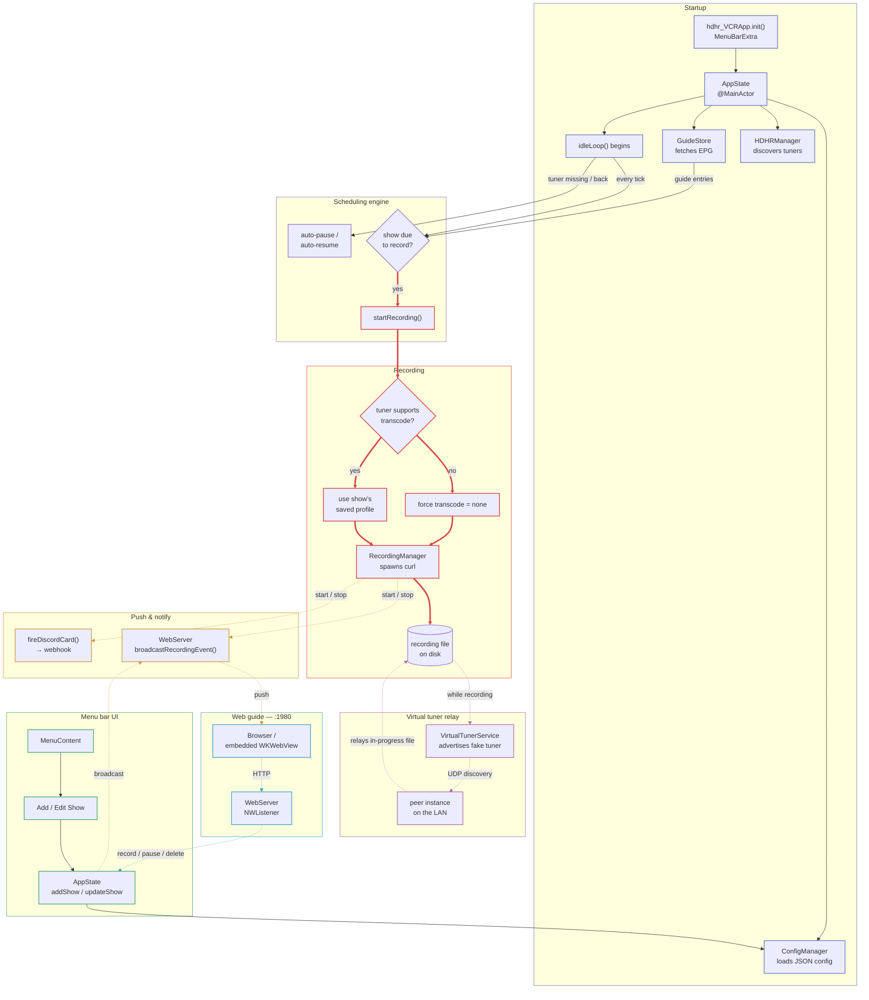

# Application Flow

How a request, a show, or a recording actually moves through the app — from tuner discovery at launch to the file that lands on disk, and everywhere that state gets pushed back out: the menu bar, the LAN web guide, Discord, and a peer instance's Watch Now.

**Reading the lines:** a **thick** edge is the critical recording write path. A **dotted** edge crosses a real process/network boundary — HTTP, SSE push, a Discord webhook, or UDP discovery. A thin solid edge is an ordinary in-process call. Each subsystem below also gets one consistent color, on its nodes, its subgraph panel, and its outgoing arrows.

## Reading it

- **Startup** — Tuner discovery runs known-hosts, mDNS, and UDP concurrently; the idle loop doesn't start scheduling until a lineup and guide exist.
- **Scheduling engine** — `idleLoop()` re-resolves each show by ID on every tick — never a cached index — because the list can mutate mid-await from the web UI.
- **Transcode gate** — The one place a show's saved transcode profile gets overridden, and only when the physical tuner can't actually transcode.
- **Push & notify** — SSE and Discord sends fire independently off the same event, each chained per-show so two lifecycle events can't race and duplicate a card.
- **Menu bar UI** — Add/Edit Show writes through the same `AppState` mutators the web guide calls — there is only one path that persists a show.
- **Web guide** — A second front door on the LAN, not a separate state machine — every mutating request still lands on the same `AppState` the menu bar uses.
- **Virtual tuner relay** — While a recording is active, this instance impersonates a second HDHomeRun so a peer can watch the same file without opening a real tuner.

Every write path funnels through `AppState`; every state change fans back out through push (SSE, Discord) rather than any client polling for it.
