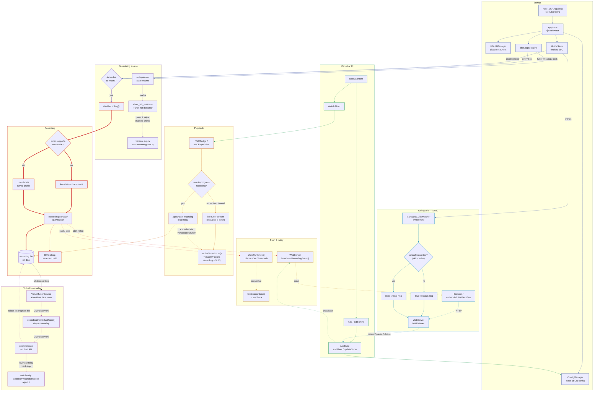

# Application Flow

How a request, a show, or a recording actually moves through the app — from tuner discovery at launch to the file that lands on disk, and everywhere that state gets pushed back out: the menu bar, the LAN web guide, Discord, in-app playback, and a peer instance's virtual tuner relay.

**Reading the lines:** a **thick** edge is the critical recording write path. A **dotted** edge crosses a real process/network boundary — HTTP, SSE push, a Discord webhook, or UDP discovery. A thin solid edge is an ordinary in-process call. Edge color marks which subsystem a hop *leaves from*; each subsystem also gets one consistent color on its nodes and its subgraph panel.

## Reading it

- **Startup** — Tuner discovery runs known-hosts, mDNS, and UDP concurrently; the idle loop doesn't start scheduling until a lineup and guide exist.
- **Scheduling engine** — `idleLoop()` re-resolves each show by ID on every tick. Auto-pause marks a tuner-missing show with a fail-reason string so the older, generic window-expiry pass knows to leave it alone instead of fighting over it.
- **Transcode gate** — The one place a show's saved transcode profile gets overridden — only when the physical tuner can't actually transcode — plus the sleep assertion that keeps the Mac awake for the duration.
- **Push & notify** — SSE and Discord sends fire independently off the same event; Discord sends for one show are chained behind each other so two lifecycle events can't race and duplicate a card.
- **Menu bar UI** — Add/Edit Show writes through the same `AppState` mutators the web guide calls — there is only one path that persists a show.
- **Playback** — Watch Now! either opens a live tuner stream (counts toward tuner occupancy) or, for a show that's currently recording, relays it from disk instead — that path is explicitly excluded from the tuner count.
- **Web guide** — A second front door on the LAN, not a separate state machine. It also renders the status ring per guide entry — scheduled (blue) or already-recorded (skip, slate) — from the same managed-show data.
- **Virtual tuner relay** — While a recording is active, this instance impersonates a second HDHomeRun so a peer can watch the same file without opening a real tuner — self-filtered out of its own device list, and hard-limited to watch-only everywhere a show gets created.

Every write path funnels through `AppState`; every state change fans back out through push (SSE, Discord) rather than any client polling for it.
